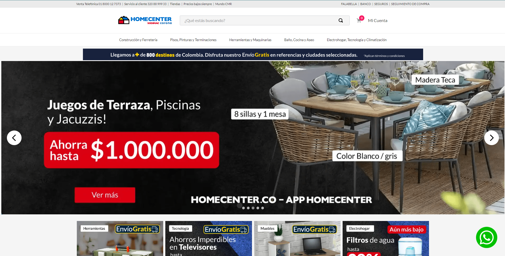
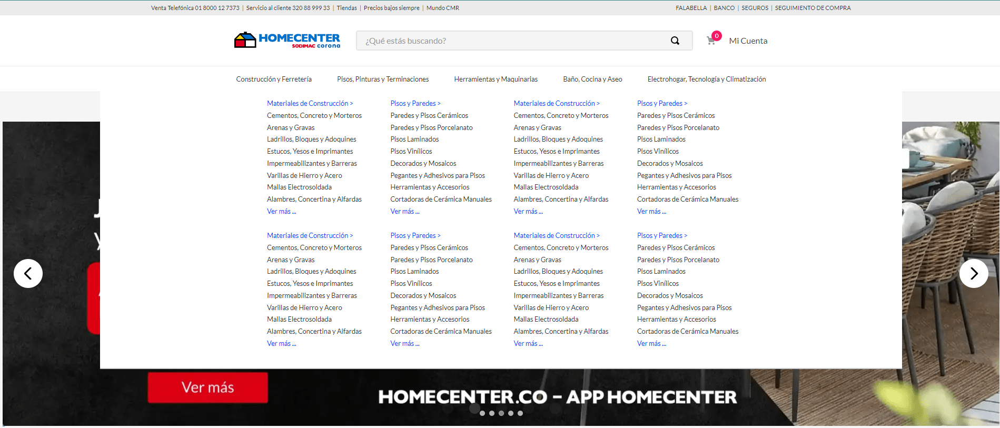
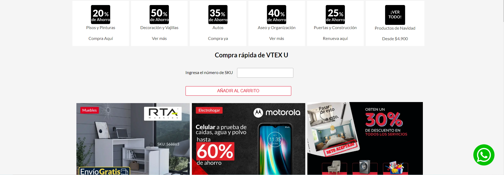
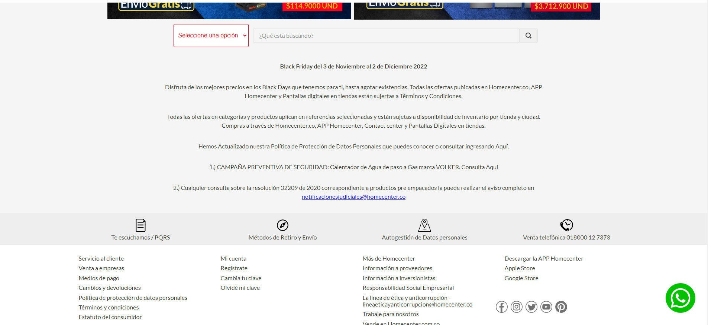

# Homecenter VTEX Theme

Homecenter store theme is a template created in VTEX based on the Homecenter storefront.

The creation of this template is merely for educational use, since with the growth of the template it has been possible to learn more about VTEX and its components.

Currently the page has its showcase and pdp page, where the user can filter the products by departments and brands, personalized pages that talk about Homecenter and a page before checkout to see all the products added to the cart.


## - Home Page, Slider and Header


## - Menu


## - Search by SKU


## - Search by categories and footer


To create a new store theme without pre-set configurations, the following repository should be used: [Store Theme](https://github.com/vtex-apps/store-theme). 

## Configuration

Next I will explain how to use the Homecenter store theme

### Step 1 -  Basic setup

Access the VTEX IO [basic setup guide](https://vtex.io/docs/getting-started/build-stores-with-store-framework/1) and follow all the given steps. 

By the end of the setup, you should have the VTEX command line interface (Toolbelt) installed along with a developer workspace you can work in.

### Step 2 - Cloning the VTEX Homecenter Theme repository

[Clone](https://github.com/KDBaron426/VTEXHomecenter) this repository to your local files to be able to effectively start working on it.

Then, access the repository's directory using your terminal. 

### Step 3 -  Installing required apps

For the creation of this template several dependencies and peerDependecies were used (the list will be below), if you want to use the store theme keep this in mind. 

For its installation, all you have to do is execute the `vtex list` command to see the list of dependencies to know which one is missing, after that use the command `vtex install vtex.name-of-the-dependeci` to install the missing dependency.

**Remember that to be able to use my store theme you have to be with an account linked to the `itgloberspartnercl` vendor or it won't work**

### Step 4 -  Uninstalling any existing theme

By running `vtex list`,  you can verify if any theme is installed.

It is common to already have a `vtex.store-theme`  installed when you start the store's front development process. 

Therefore, if you find it in the app's list, copy its name and use it together with the command `vtex uninstall`. For example:

```json
vtex uninstall vtex.store-theme
```

### Step 5- Run and preview the store theme

Then time has come to upload all the changes you made in your local files to the platform. For that, use the `vtex link` command. 

If the process runs without any errors, the following message will be displayed: `App linked successfully`. Then, run the `vtex browse` command to open a browser window having your linked store in it.

This will enable you to see the applied changes in real time, through the account and workspace in which you are working.

## peerDependencies
These are the peerDependencies used in the store theme:

- "vtex.wish-list": "1.x",
- "vtex.questions-and-answers": "0.x",
- "vtex.mega-menu": "2.x"

## Dependencies
These are the Dependencies used in the store theme:

- "vtex.store": "2.x",
- "vtex.store-header": "2.x",
- "vtex.product-summary": "2.x",
- "vtex.store-footer": "2.x",
- "vtex.store-components": "3.x",
- "vtex.styleguide": "9.x",
- "vtex.slider": "0.x",
- "vtex.carousel": "2.x",
- "vtex.shelf": "1.x",
- "vtex.menu": "2.x",
- "vtex.minicart": "2.x",
- "vtex.product-details": "1.x",
- "vtex.product-kit": "1.x",
- "vtex.search": "2.x",
- "vtex.search-result": "3.x",
- "vtex.login": "2.x",
- "vtex.my-account": "1.x",
- "vtex.flex-layout": "0.x",
- "vtex.rich-text": "0.x",
- "vtex.store-drawer": "0.x",
- "vtex.locale-switcher": "0.x",
- "vtex.product-quantity": "1.x",
- "vtex.product-identifier": "0.x",
- "vtex.product-specification-badges": "0.x",
- "vtex.product-specifications": "1.x",
- "vtex.product-review-interfaces": "1.x",
- "vtex.telemarketing": "2.x",
- "vtex.order-placed": "2.x",
- "vtex.stack-layout": "0.x",
- "vtex.tab-layout": "0.x",
- "vtex.responsive-layout": "0.x",
- "vtex.slider-layout": "0.x",
- "vtex.iframe": "0.x",
- "vtex.breadcrumb": "1.x",
- "vtex.sticky-layout": "0.x",
- "vtex.add-to-cart-button": "0.x",
- "vtex.store-icons": "0.x",
- "vtex.modal-layout": "0.x",
- "vtex.product-list": "0.x",
- "vtex.disclosure-layout": "1.x",
- "vtex.store-link": "0.x",
- "vtex.condition-layout": "2.x",
- "vtex.checkout-summary": "0.x",

## Custom Apps
These are the custom apps that I have created for the theme store, I will leave the links to the repositories so they can be used:
- ["itgloberspartnercl.whatsapp-button": "0.x"](https://github.com/KDBaron426/itgloberspartnerc-WhastApp-btn)
- ["itgloberspartnercl.bullets-diagramation": "0.x"](https://github.com/KDBaron426/itgloberspartnerc-bullets-diagramation),
- ["itgloberspartnercl.add-to-cart-info": "0.x"](https://github.com/KDBaron426/itgloberspartnercl-add-to-cart-info),
- ["itgloberspartnercl.custom-department-search": "0.x"](https://github.com/KDBaron426/itgloberspartnercl-custom-deparment-search),
- ["itgloberspartnercl.pdf-reader": "0.x"](https://github.com/KDBaron426/itgloberspartnercl-html-pdf),
- ["itgloberspartnercl.quick-order": "0.x"](https://github.com/KDBaron426/itgloberspartnercl-quick-order),
- ["itgloberspartnercl.special-diagramation": "0.x"](https://github.com/KDBaron426/itgloberspartnercl-custom-diagramation-template)